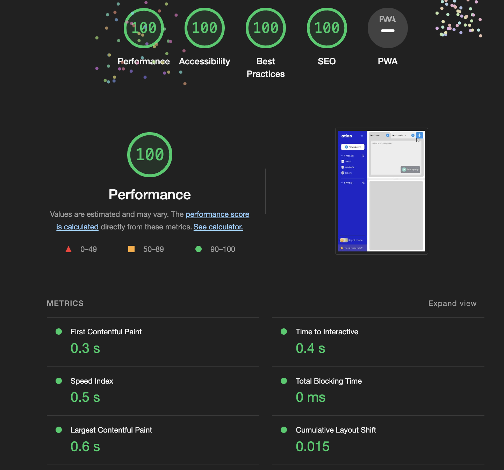

# SQL Editor

 ## Overview:
<b>web app capable of running SQL queries and displaying the results of said query</b>

Live: [https://sql-query-runner-topaz.vercel.app/](https://sql-query-runner-topaz.vercel.app/)

 ## Requirements:

### Core
  - Input area for SQL query
  - Ability to toggle between queries
  - Show table corresponding to the query
  - Infinite scroll on table

### Advanced
- Autocomplete query with TAB button
- Keyboard shortcuts (Shift + R => Run query)
- SQL query to work correctly with help of regex
- SQL query validation
- Bookmark a query
- Ability to resize b/w query and table tabs
- Dark/Light mode

## Framework & Packages

- React
- Typescript
- react-split (for split view b/w query and table)
- react-hot-keys (for keyboard shortcuts)
- @testing-library/react (unit testing)
- styled-components (CSS in JSX)

## Page load time

## Optimisations

- Conditionally render elements to reduce DOM load
- Styled-components adds CSS on demand
- font-swap to reduce latency
- add height/width on image to reduce Content-Layout-Shift
- Lazy loading was not required as all elements are required and on 1 screen

## Best Practices
- Typescript
- Unit testing

